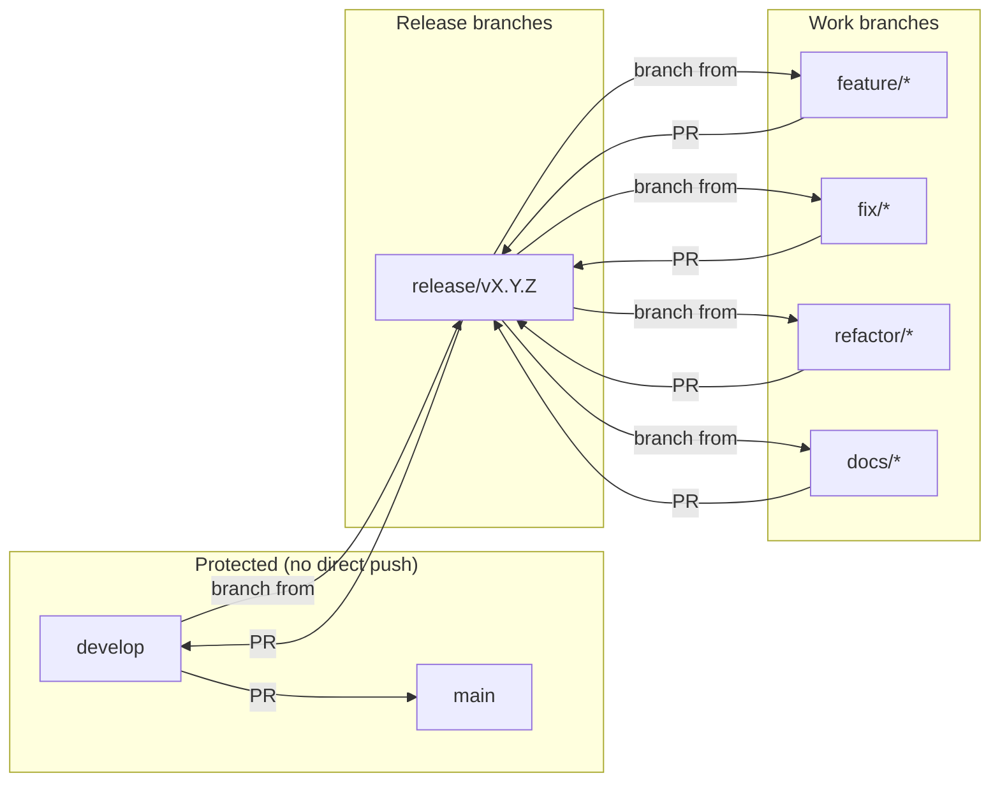

# Branch Management Guide

## Purpose

Manage branch strategy, naming conventions, and PR rules for breakdownprompt.

- Full release flow (version bump -> tag -> merge): see `/release-procedure` skill
- CI execution and troubleshooting: see `/local-ci` skill

## Branch Strategy

### Flow



### Merge Direction

```
Work branch → release/vX.Y.Z → develop → main → vtag
```

## Rules

| Operation | Allowed | Prohibited |
|-----------|---------|------------|
| Changes to main | PR merge from develop only | Direct push, merge from other branches |
| Changes to develop | PR merge from release/* only | Direct push |
| Create release/* | Branch from develop | Branch from main or work branches |
| Create work branches | Branch from release/* | Branch from main or develop directly |

## Procedures

### Create a work branch

```bash
git checkout release/vX.Y.Z
git checkout -b feature/my-feature
```

### Create a PR

| Current branch | PR target | Command |
|---------------|-----------|---------|
| feature/*, fix/*, refactor/*, docs/* | release/vX.Y.Z | `gh pr create --base release/vX.Y.Z` |
| release/* | develop | `gh pr create --base develop` |
| develop | main | `gh pr create --base main` |

### Merge a PR

1. Verify CI passes: `gh pr checks <PR#>`
2. Merge with appropriate strategy:

| Merge method | Use case | Command |
|-------------|----------|---------|
| Squash | Work branch -> release (clean history) | `gh pr merge --squash` |
| Merge | release -> develop (preserve history) | `gh pr merge --merge` |
| Merge | develop -> main (preserve history) | `gh pr merge --merge` |

3. Update local:

```bash
git checkout <target-branch>
git pull origin <target-branch>
```

## Branch naming conventions

```
feature/*  - New features
fix/*      - Bug fixes
refactor/* - Refactoring
docs/*     - Documentation changes
release/vX.Y.Z - Release preparation
```

## Warning patterns

| Operation | Warning |
|-----------|---------|
| `git push origin main` | Direct push to main is prohibited. Create a PR from develop. |
| `git push origin develop` | Direct push to develop is prohibited. Create a PR from release/*. |
| `git checkout -b feature/* develop` | Work branches must branch from release/*. |
| `git merge main` | Merging from main is not expected. Check the branch origin. |
