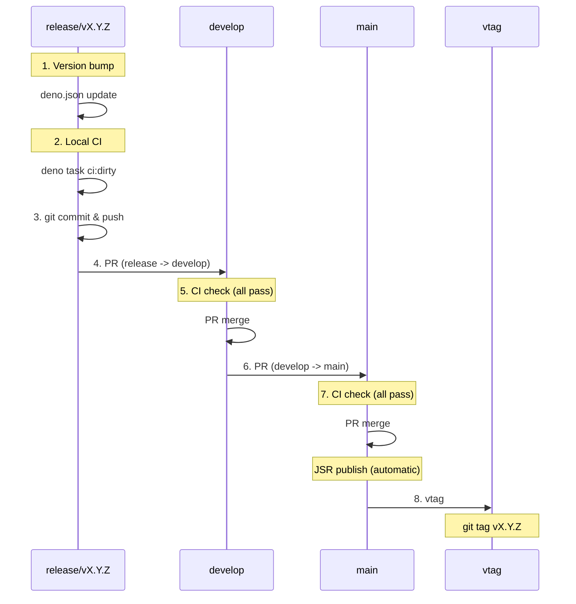

# Release Procedure

## Responsibilities

Manage the full release flow (version bump -> tag -> PR -> merge).

- Branch strategy details: see `/branch-management` skill
- CI execution and troubleshooting: see `/local-ci`, `/ci-troubleshooting` skills

## Version Files

| File | Field | Example |
|------|-------|---------|
| `deno.json` | `"version": "x.y.z"` | `"version": "1.2.5"` |

## Version Bump Type

```
Patch (x.y.Z): Bug fixes, documentation improvements
Minor (x.Y.0): New features (backwards compatible)
Major (X.0.0): Breaking changes
```

## Release Flow



## Detailed Steps

### Step 0: Preparation

```bash
# Verify work branches are merged into release/*
git checkout release/vX.Y.Z
git log --oneline -10
```

### Step 1: Version bump on release/*

```bash
# Create release branch from develop
git checkout develop
git checkout -b release/vX.Y.Z

# Run automated version bump
scripts/bump_version.sh --patch  # or --minor, --major

# Verify
grep '"version"' deno.json
```

### Step 2: Local CI

```bash
deno task ci:dirty
```

### Step 3: Commit & push

```bash
git add deno.json
git commit -m "chore: bump version to X.Y.Z"
git push -u origin release/vX.Y.Z
```

### Step 4: release/* -> develop PR

```bash
gh pr create --base develop --head release/vX.Y.Z \
  --title "Release vX.Y.Z: <summary>" \
  --body "## Summary
- <changes>

## Version
- X.Y.Z"
```

### Step 5: CI check & merge to develop

```bash
gh pr checks <PR#> --watch
gh pr merge <PR#> --merge
```

### Step 6: develop -> main PR

```bash
gh pr create --base main --head develop \
  --title "Release vX.Y.Z" \
  --body "Release version X.Y.Z to production"
```

### Step 7: CI check & merge to main

```bash
gh pr checks <PR#> --watch
gh pr merge <PR#> --merge
```

**Automatic**: JSR publish runs on main merge.

### Step 8: vtag

```bash
git fetch origin main
git tag vX.Y.Z origin/main
git push origin vX.Y.Z
```

### Step 9: Cleanup

```bash
git branch -D release/vX.Y.Z
git push origin --delete release/vX.Y.Z
```

## Important: No Consecutive Merges Without User Approval

**Each merge step (release -> develop, develop -> main) requires explicit user instruction.**

Prohibited:
- Consecutive merges without user confirmation
- Merging to main from vague instructions like "release it"
- Self-initiated develop -> main merge

Correct:
1. Report PR creation, wait for user instruction
2. Confirm explicit scope ("merge to develop" or "merge to main")
3. Wait for user instruction before vtag creation

## Quick Reference

```
Version bump:
  scripts/bump_version.sh [--major|--minor|--patch]
  scripts/bump_version.sh --status  # Check progress

Release flow:
  1. release/* -> develop PR
  2. gh pr checks <PR#> --watch
  3. gh pr merge <PR#> --merge
  4. develop -> main PR
  5. gh pr checks <PR#> --watch
  6. gh pr merge <PR#> --merge (JSR publish automatic)
  7. vtag: git tag vX.Y.Z origin/main && git push origin vX.Y.Z
  8. Cleanup: branch deletion (/branch-management)

Related skills:
  - CI execution/troubleshooting: /local-ci, /ci-troubleshooting
  - Branch strategy/deletion: /branch-management
```
