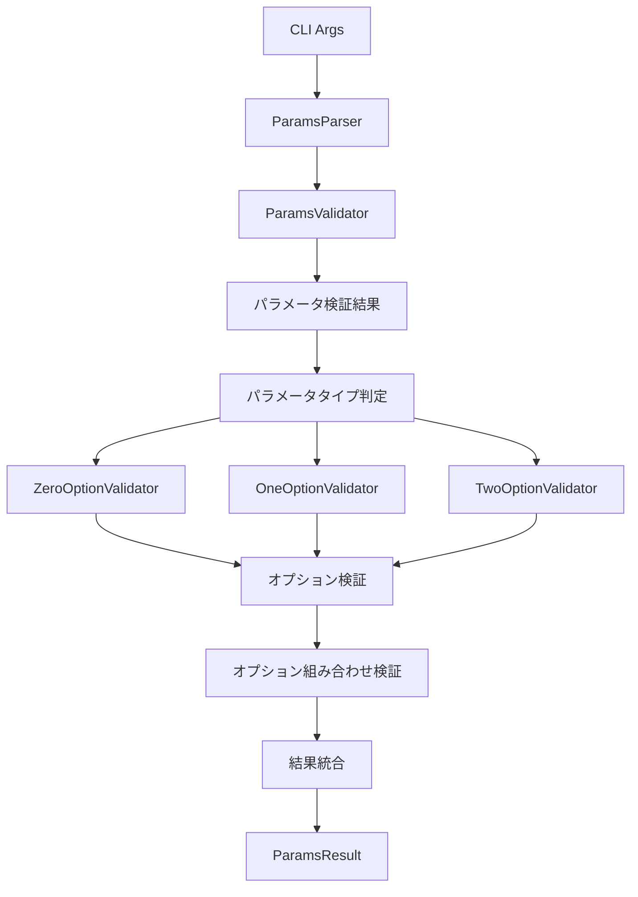

# アーキテクチャ概要

このドキュメントは、breakdownparamsライブラリのアーキテクチャの概要を説明します。

## 1. コアコンセプト

### 1.1 最上位の目的
パラメータとオプションの処理を完全に分離し、最終的な結果を統合して返却する。



### 1.2 責務の分離
- パラメータのバリデーションとオプションのバリデーションを完全に分離
- 各バリデータは単一の責務のみを持つ
- パラメータの検証結果に基づいて適切なオプション検証を実行

### 1.3 パラメータの3区分
パラメータの検証結果は3つの型に分類される：

```typescript
type ParamsResult =
  | ZeroParamsResult   // パラメータなし
  | OneParamResult     // init のみ
  | TwoParamResult     // 指示型 + レイヤー型
  | ErrorResult;       // エラー
```

## 2. 主要コンポーネント

### 2.1 パーサー（ParamsParser）

```typescript
interface ParamsParser {
  parse(args: string[]): ParamsResult;
}
```

- **責務**:
  1. 3つのパラメータバリデータを同時に作成
  2. パラメータの検証結果に基づいて適切なオプションバリデータを選択
  3. オプションの個別検証を実行
  4. オプションの組み合わせ検証を実行
  5. 検証結果を統合して適切な結果型を返却

- **重要な制約**:
  - ParamsResultは必ずParamsParserによって作成
  - バリデータから受け取った型を直接返却することは禁止
  - 全ての処理をバリデーションに移譲し、結果を判定してParamsResultを作成
  - パラメータの検証結果に基づいて適切なオプション検証を実行

### 2.2 パラメータバリデータ（ParamsValidator）

```typescript
interface ParamsValidator {
  validate(args: string[]): ValidationResult;
}
```

- **種類**:
  - ZeroParamsValidator: パラメータなしの検証
  - OneParamValidator: init のみの検証
  - TwoParamValidator: 指示型とレイヤー型の検証

- **判定ルール**:
  - 成功・失敗・失敗: ZeroParamsResult
  - 失敗・成功・失敗: OneParamResult
  - 失敗・失敗・成功: TwoParamResult
  - その他: ErrorResult

### 2.3 オプション（Option）

```typescript
interface Option {
  validate(value: string): ValidationResult;
}
```

- **種類**:
  - FlagOption: フラグオプション
  - TextOption: テキスト値オプション
  - EnumOption: 列挙型オプション
  - UserVariableOption: ユーザー変数オプション（--uv-*）

- **責務**:
  - オプション単体のバリデーション
  - パラメータとの組み合わせは知らない
  - パラメータ3区分に応じて使用可能なオプションを事前定義
  - パラメータ3区分が判明後に組み合わせ検証

## 3. 処理フロー

1. **入力**: CLIコマンドライン引数
2. **パラメータ検証**:
   - 3つのバリデータで同時に検証
   - 成功・失敗の組み合わせで結果を判定
3. **オプション検証**:
   - パラメータの結果に応じた適切なオプションバリデータを選択
   - 個別のオプション検証を実行
   - オプションの組み合わせ検証を実行
4. **結果統合**:
   - パラメータの結果にオプションの結果を含める
   - ParamsParserが適切な結果型を作成
5. **出力**: 統合された結果

## 4. 使用例

```typescript
const parser = new ParamsParser();

// パラメータとオプションの検証を実行し、結果を統合
const result = parser.parse(["init", "--from=input.md"]);

// 結果に応じた処理
if (result.type === "one") {
  // OneParamResult の処理
  // オプションの結果も含まれている
} else if (result.type === "error") {
  // ErrorResult の処理
}
```

## 5. 制約

- パラメータとオプションの検証は完全に独立
- パラメータの結果は必ず3区分のいずれか
- オプションの結果はパラメータの結果に含まれる
- 各バリデータは単一の責務のみを持つ
- ParamsResultは必ずParamsParserによって作成
- バリデータの結果型を直接返却することは禁止
- パラメータの検証結果に基づいて適切なオプション検証を実行
- オプションの個別検証の後に組み合わせ検証を実行

---

[日本語版](layer1_overview.ja.md) | [English Version](layer1_overview.md) 