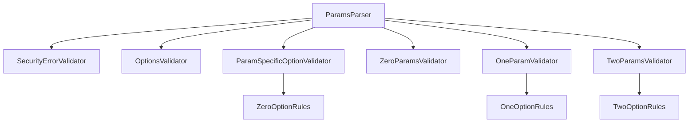
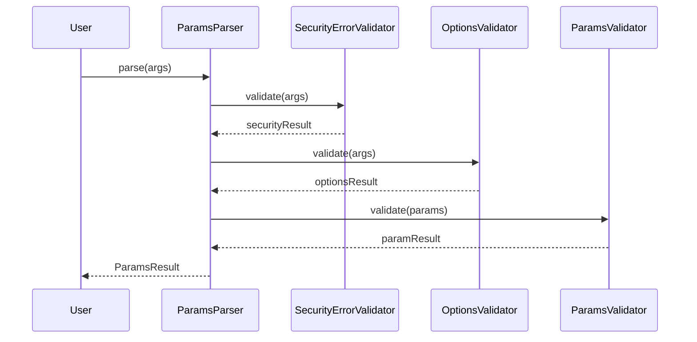
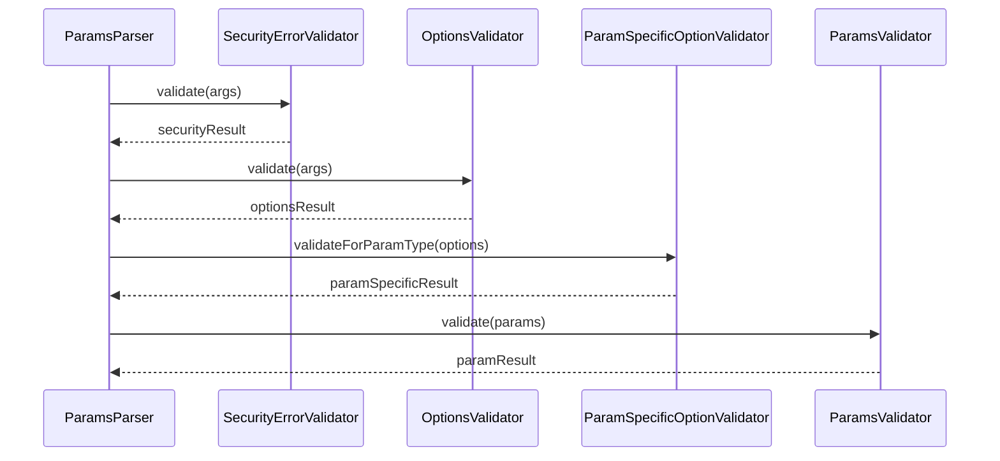
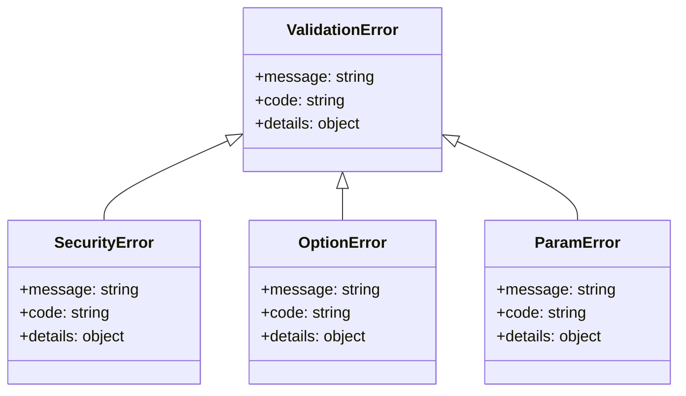
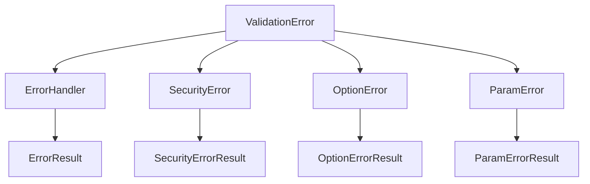
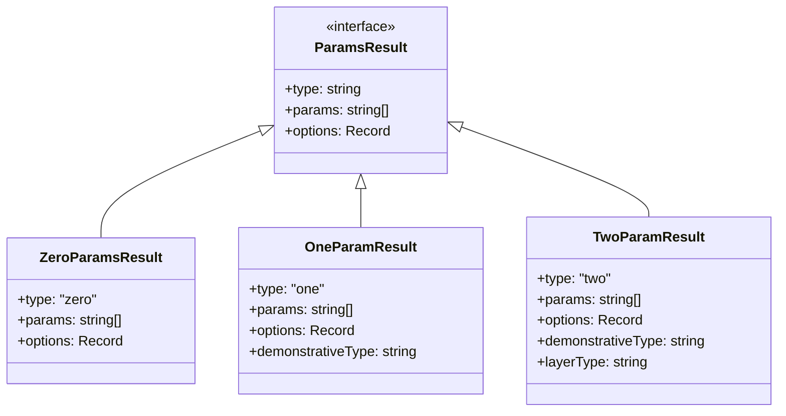
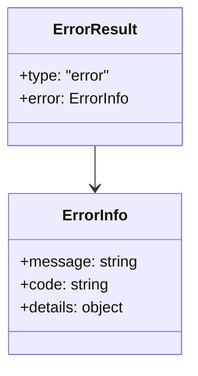
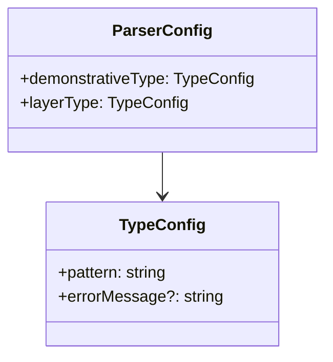
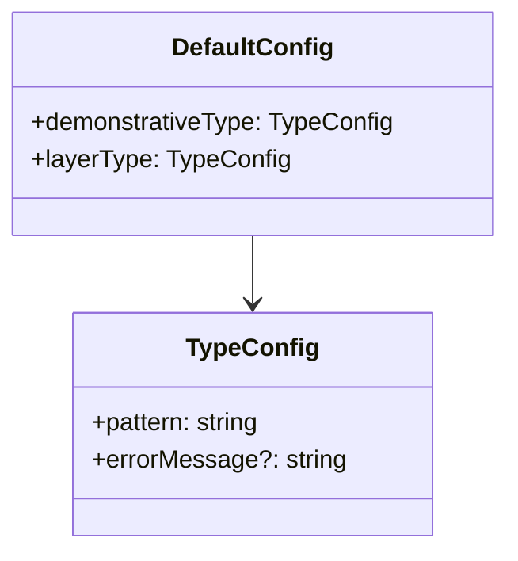

# Architecture Overview

This document provides an overview of the breakdownparams library architecture.

## 1. System Structure

## 2. Component Description

### 2.1 Core Components

1. **ParamsParser**
   - Main entry point for parameter parsing
   - Coordinates validation flow
   - Returns parsed results

2. **SecurityErrorValidator**
   - Validates input security
   - Checks for security violations
   - Prevents malicious input

3. **OptionsValidator**
   - Validates common options
   - Checks option format and values
   - Ensures option consistency

4. **ParamSpecificOptionValidator**
   - Validates options specific to parameter types
   - Applies type-specific rules
   - Ensures parameter-option compatibility

5. **ParamsValidator**
   - Validates parameter format and values
   - Applies parameter-specific rules
   - Ensures parameter consistency

### 2.2 Validation Rules

1. **ZeroOptionRules**
   - Rules for zero parameter options
   - Format and value validation
   - Type-specific constraints

2. **OneOptionRules**
   - Rules for one parameter options
   - Format and value validation
   - Type-specific constraints

3. **TwoOptionRules**
   - Rules for two parameter options
   - Format and value validation
   - Type-specific constraints

## 3. Data Flow

### 3.1 Input Processing

### 3.2 Validation Flow

## 4. Error Handling

### 4.1 Error Types

### 4.2 Error Flow

## 5. Result Types

### 5.1 Success Results

### 5.2 Error Results

## 6. Configuration

### 6.1 Parser Configuration

### 6.2 Default Configuration

---

[日本語版](layer1_overview.ja.md) | [English Version](layer1_overview.md) 