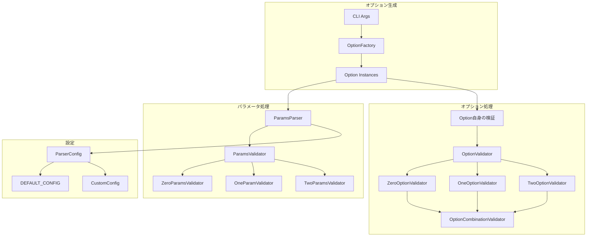
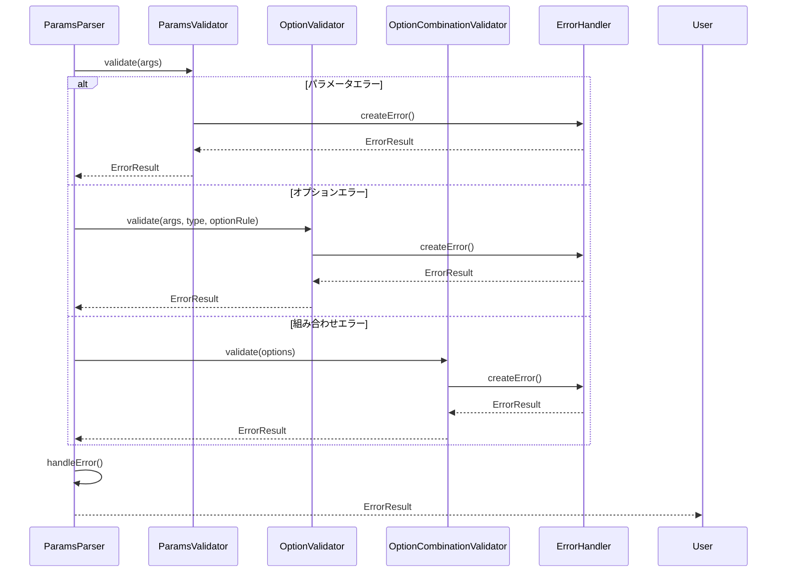
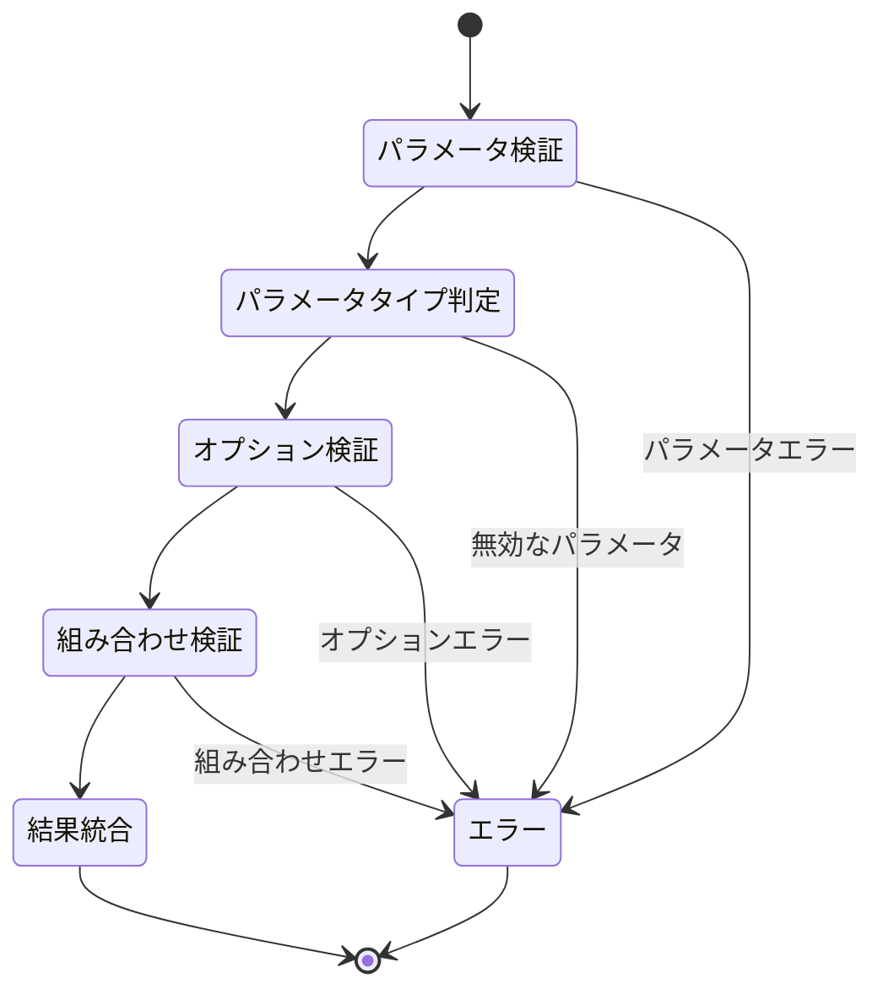
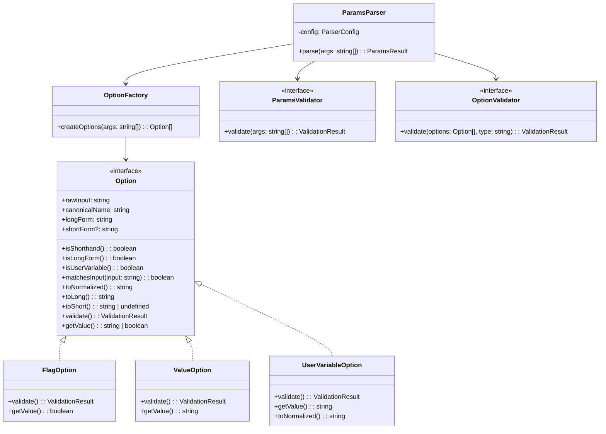
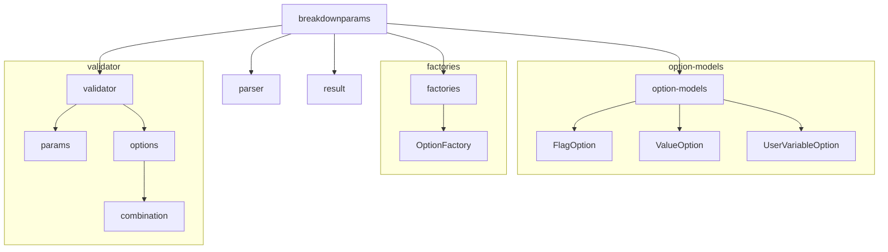

# アーキテクチャ図

このドキュメントは、breakdownparamsライブラリのアーキテクチャを図で説明します。

## 1. コンポーネント図



## 2. シーケンス図

### 2.1 パラメータ解析フロー

```mermaid
sequenceDiagram
    participant User
    participant Factory as OptionFactory
    participant Option as Option Instance
    participant Parser as ParamsParser
    participant PValidator as ParamsValidator
    participant OValidator as OptionValidator
    participant OCombValidator as OptionCombinationValidator
    participant Result as ParamsResult
    
    User->>Factory: createOptions(args)
    Factory->>Option: new Option(rawInput)
    Option->>Option: 入力形式判定
    Option->>Option: 正規化
    Factory-->>Parser: Option[]
    
    Parser->>Option: toNormalized()
    Parser->>Option: getValue()
    
    Parser->>PValidator: validate(params)
    PValidator->>PValidator: パラメータ検証実行
    PValidator-->>Parser: パラメータ検証結果
    
    Parser->>Option: validate()
    Option->>Option: 自身の検証
    Option-->>Parser: 個別検証結果
    
    alt パラメータタイプ判定
        Parser->>OValidator: validate(options, type)
        OValidator-->>Parser: オプション検証結果
        
        Parser->>OCombValidator: validate(options)
        OCombValidator-->>Parser: 組み合わせ検証結果
    end
    
    Parser->>Parser: 結果の統合
    Parser->>Result: 適切なResult作成
    Result-->>User: 最終結果
```

### 2.2 エラー処理フロー



## 3. 状態遷移図

### 3.1 バリデーション状態



## 4. データフロー図

```mermaid
graph LR
    A[CLI Args] --> B[OptionFactory]
    B --> C[Option Instances]
    C --> D[ParamsParser]
    
    subgraph "パラメータ処理"
        D --> E1[ParamsValidator]
        E1 --> F1[パラメータ検証結果]
    end
    
    subgraph "オプション処理"
        C --> G[Option.validate()]
        G --> H[個別検証結果]
        F1 --> I[パラメータタイプ判定]
        I --> J1[ZeroOptionValidator]
        I --> J2[OneOptionValidator]
        I --> J3[TwoOptionValidator]
        J1 --> K[組み合わせ検証]
        J2 --> K
        J3 --> K
    end
    
    F1 --> L[結果統合]
    H --> L
    K --> L
    L --> M[ParamsResult]
```

## 5. クラス階層図



## 6. パッケージ図



---

[日本語版](layer2_diagrams.ja.md) | [English Version](layer2_diagrams.md) 