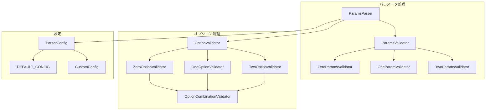
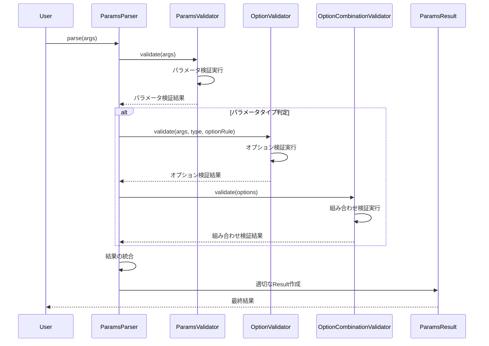
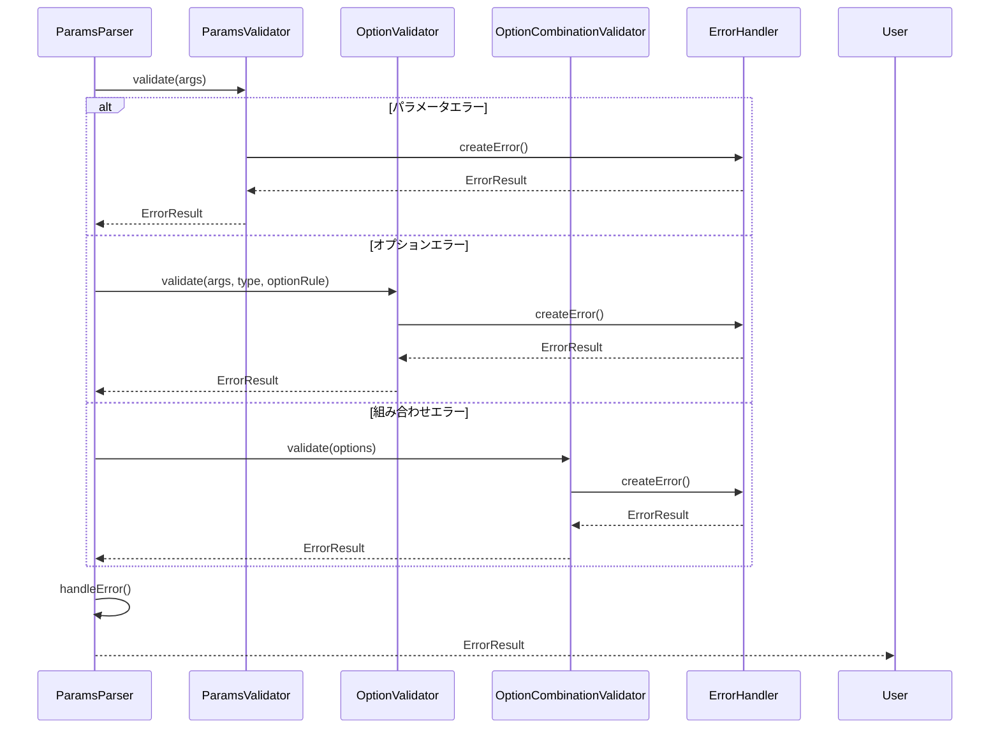
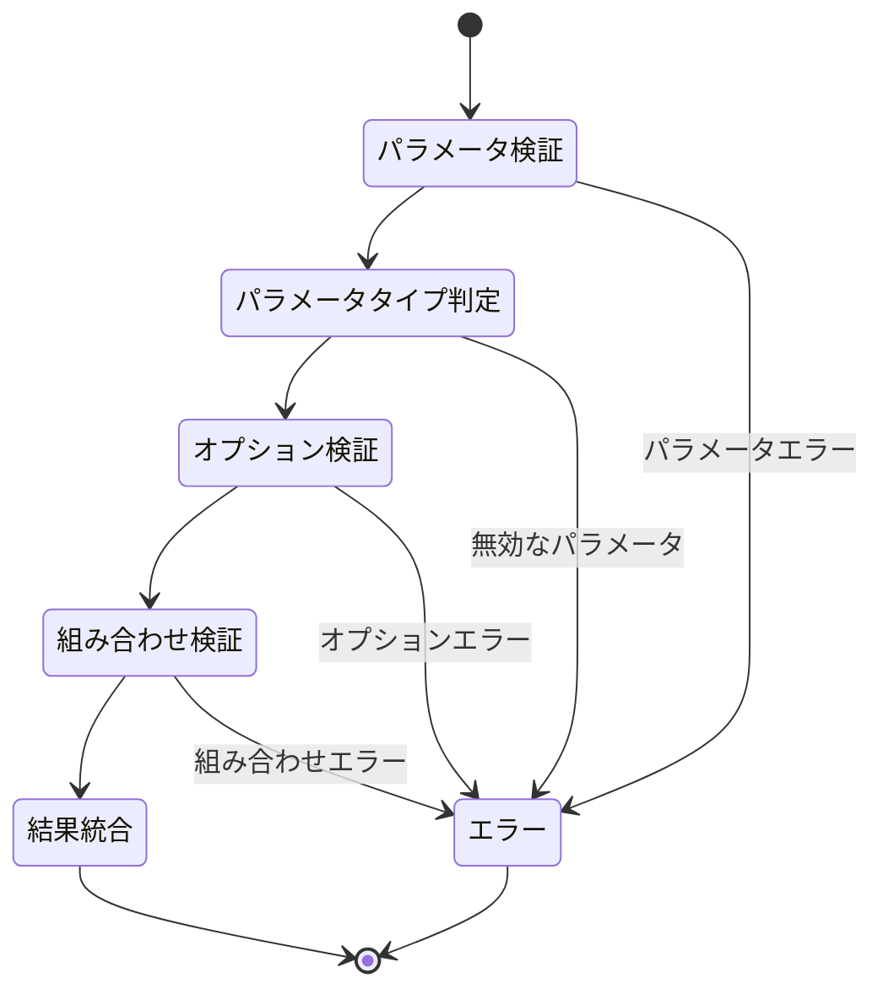
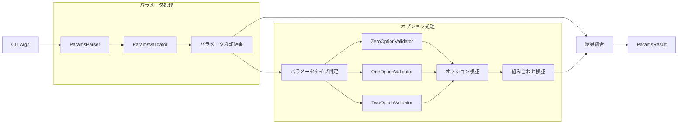
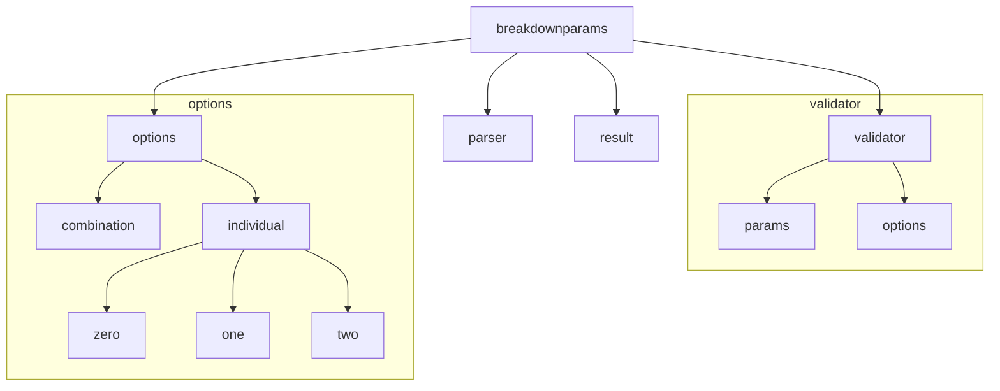

# アーキテクチャ図

このドキュメントは、breakdownparamsライブラリのアーキテクチャを図で説明します。

## 1. コンポーネント図

## 2. シーケンス図

### 2.1 パラメータ解析フロー

### 2.2 エラー処理フロー

## 3. 状態遷移図

### 3.1 バリデーション状態

## 4. データフロー図

## 5. クラス階層図

```mermaid
classDiagram
    class ParamsParser {
        +parse(args: string[]): ParamsResult
        -config: ParserConfig
    }
    
    class ParamsValidator {
        <<interface>>
        +validate(args: string[]): ValidationResult
    }
    
    class OptionValidator {
        <<interface>>
        +validate(args: string[], type: string, optionRule: OptionRule): ValidationResult
    }
    
    class ZeroParamsValidator {
        +validate(args: string[]): ValidationResult
    }
    
    class OneParamValidator {
        +validate(args: string[]): ValidationResult
    }
    
    class TwoParamsValidator {
        +validate(args: string[]): ValidationResult
    }
    
    class ZeroOptionValidator {
        +validate(args: string[], type: string, optionRule: OptionRule): ValidationResult
    }
    
    class OneOptionValidator {
        +validate(args: string[], type: string, optionRule: OptionRule): ValidationResult
    }
    
    class TwoOptionValidator {
        +validate(args: string[], type: string, optionRule: OptionRule): ValidationResult
    }
    
    class OptionCombinationValidator {
        +validate(options: Record<string, unknown>): OptionCombinationResult
    }
    
    ParamsParser --> ParamsValidator
    ParamsParser --> OptionValidator
    ParamsValidator <|.. ZeroParamsValidator
    ParamsValidator <|.. OneParamValidator
    ParamsValidator <|.. TwoParamsValidator
    OptionValidator <|.. ZeroOptionValidator
    OptionValidator <|.. OneOptionValidator
    OptionValidator <|.. TwoOptionValidator
    ParamsParser --> OptionCombinationValidator
```

## 6. パッケージ図

---

[日本語版](layer2_diagrams.ja.md) | [English Version](layer2_diagrams.md) 