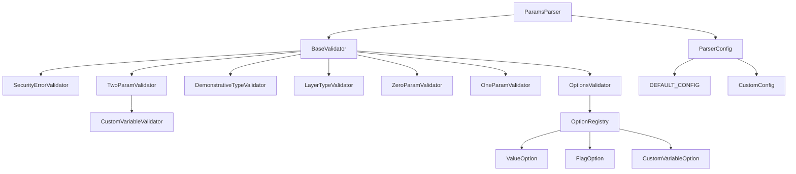
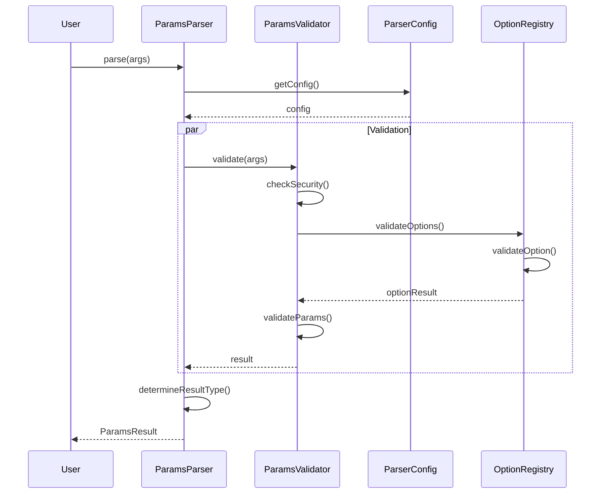
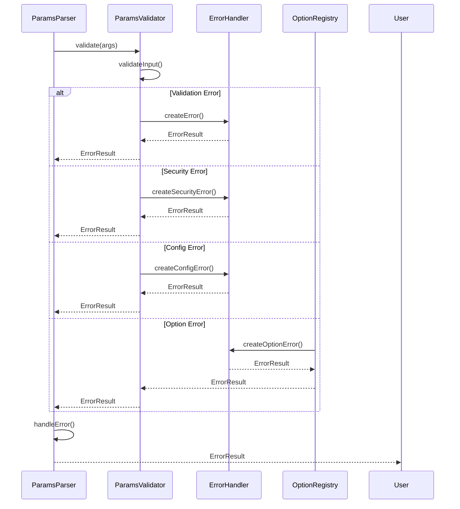
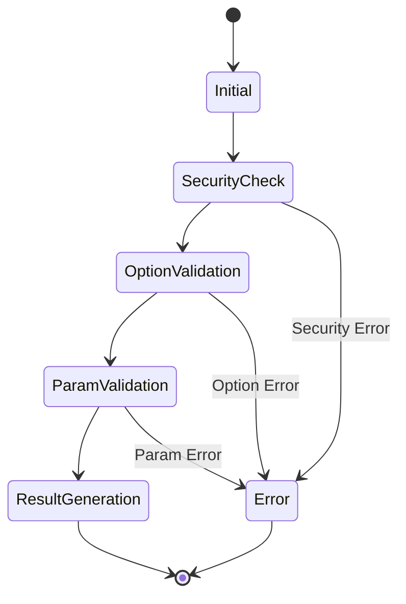
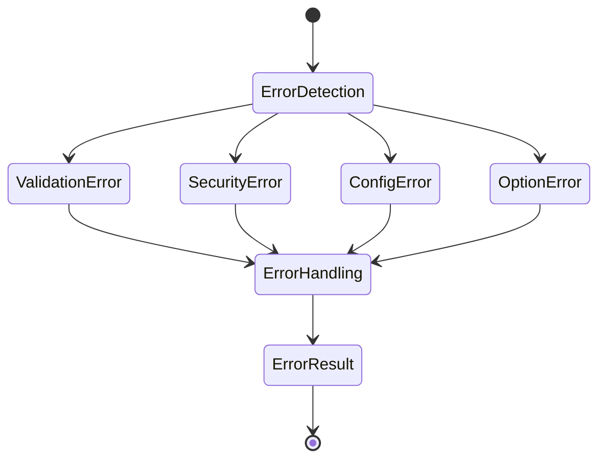
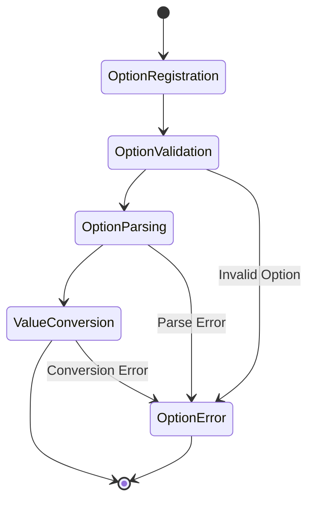
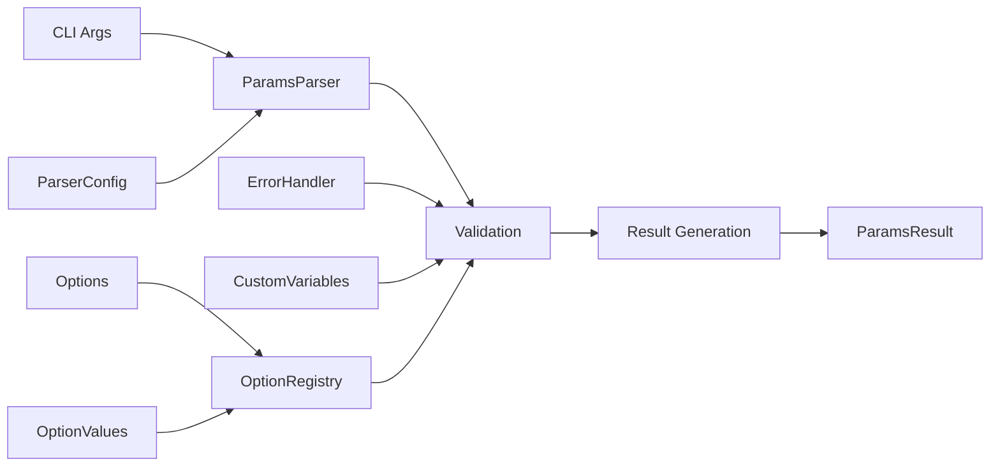
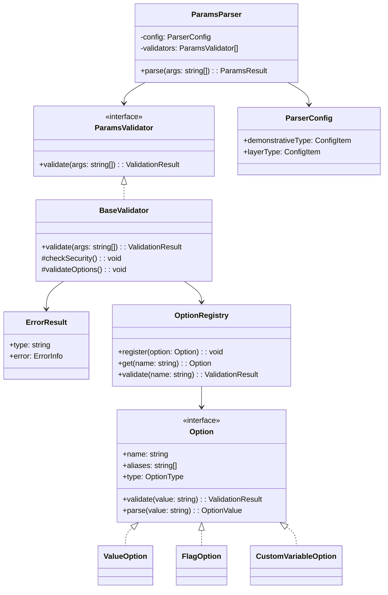
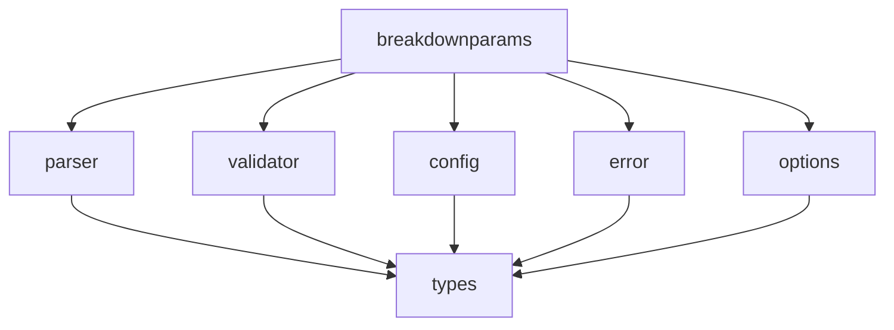

# アーキテクチャ図

このドキュメントは、breakdownparamsライブラリのアーキテクチャを図で説明します。

## 1. コンポーネント図



## 2. シーケンス図

### 2.1 パラメータ解析フロー



### 2.2 エラー処理フロー



### 2.3 オプション処理フロー

```mermaid
sequenceDiagram
    participant Parser as ParamsParser
    participant Registry as OptionRegistry
    participant Option as Option
    
    Parser->>Registry: register(option)
    Registry->>Option: validate()
    Option->>Option: validateValue()
    Option-->>Registry: ValidationResult
    
    Parser->>Registry: parse(args)
    Registry->>Option: parse(value)
    Option->>Option: convertValue()
    Option-->>Registry: OptionValue
    Registry-->>Parser: ParsedOptions
```

## 3. 状態遷移図

### 3.1 バリデーション状態



### 3.2 エラー状態



### 3.3 オプション状態



## 4. データフロー図



## 5. クラス階層図



## 6. パッケージ図



---

[日本語版](layer2_diagrams.ja.md) | [English Version](layer2_diagrams.md) 