# Architecture Diagrams

This document provides diagrams that illustrate the breakdownparams library architecture.

## 1. Component Diagrams

### 1.1 Overall Structure
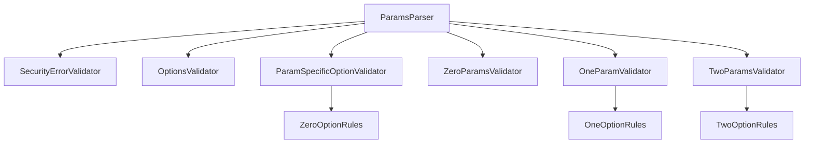

### 1.2 Validation Structure
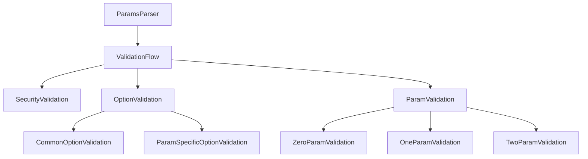

## 2. Sequence Diagrams

### 2.1 Parameter Parsing Flow
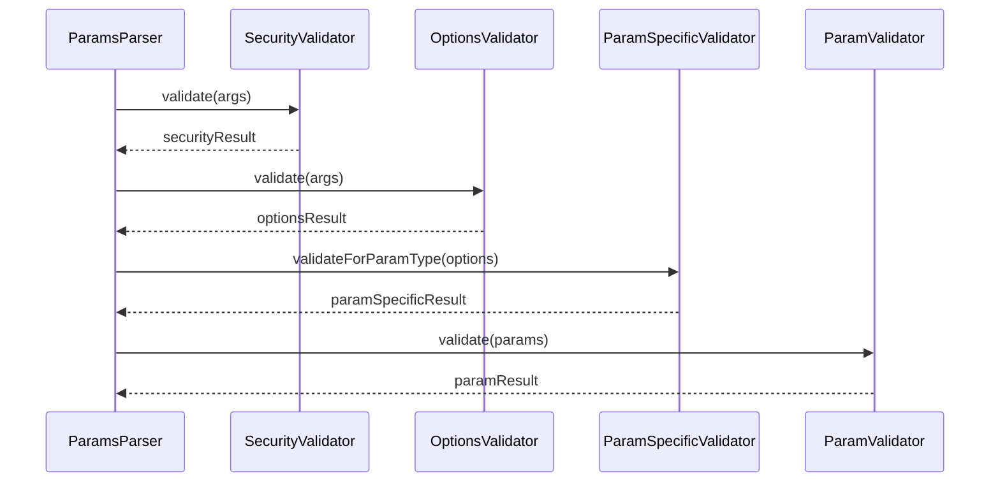

### 2.2 Option Validation Flow
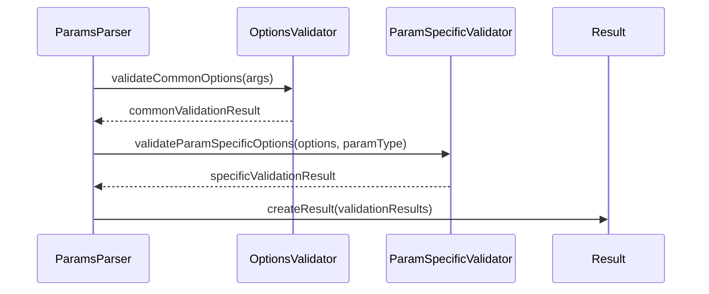

## 3. State Transition Diagrams

### 3.1 Parameter Parsing State Transition
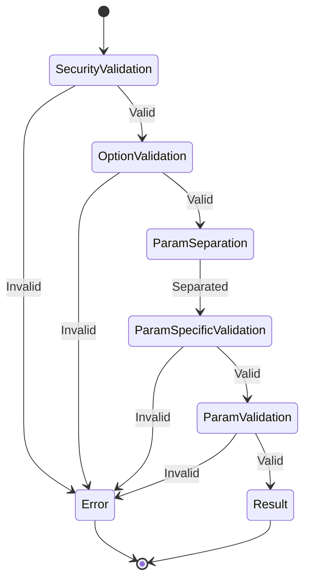

### 3.2 Option Validation State Transition
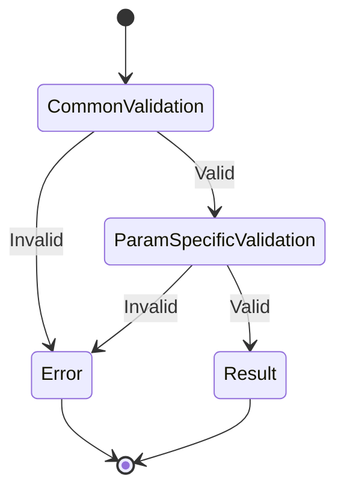

## 4. Class Diagrams

### 4.1 Validator Structure
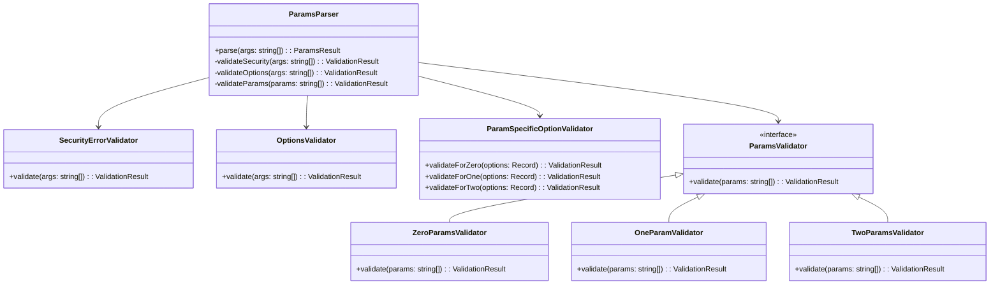

### 4.2 Result Type Structure
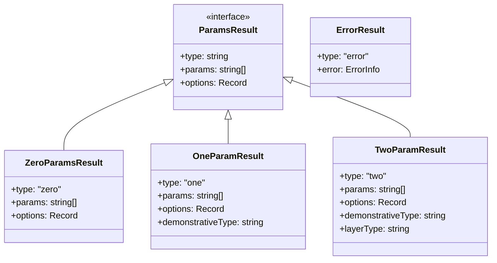

## 5. Data Flow Diagrams

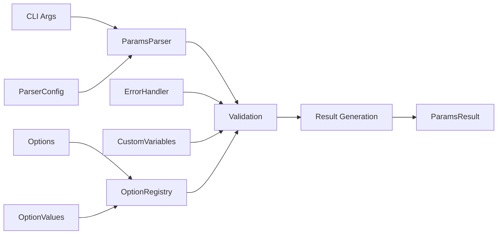

## 6. Class Hierarchy Diagrams

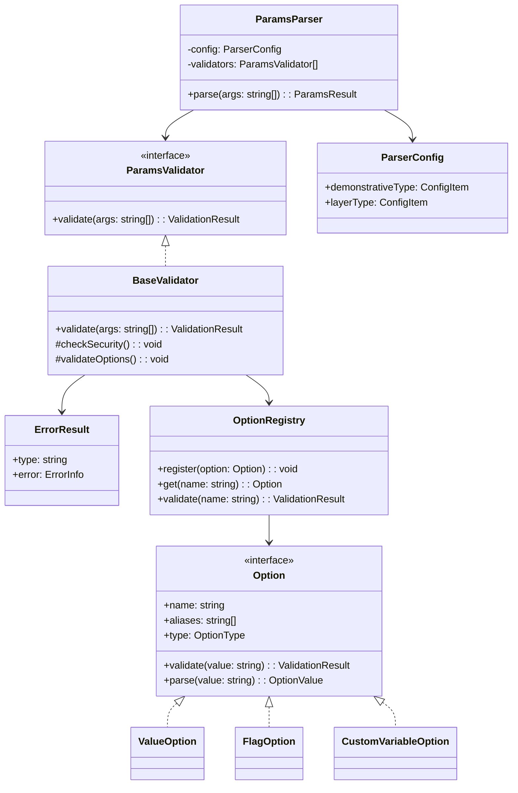

## 7. Package Diagrams

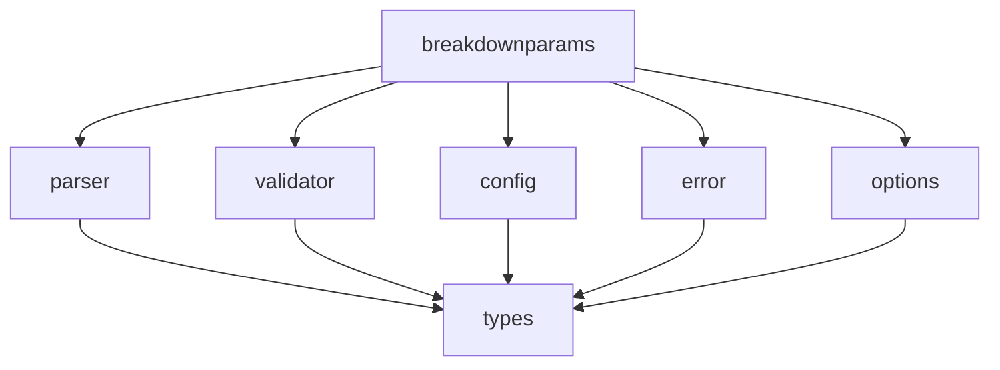

---

[Japanese Version](layer2_diagrams.ja.md) | [English Version](layer2_diagrams.md) 