# Validation Design

This document describes the validation design of the breakdownparams library.

## 1. Overall Validation Structure

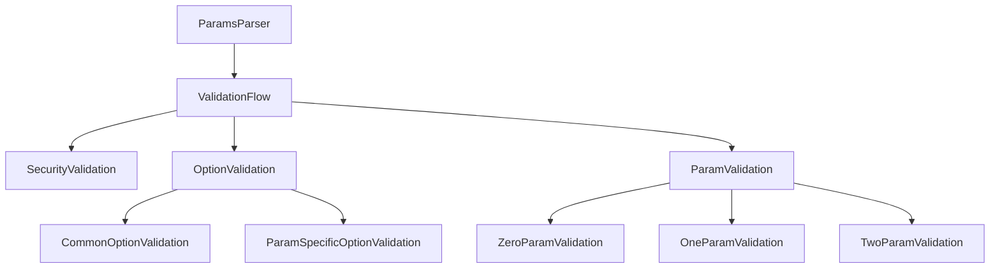

## 2. Validation Details

### 2.1 Security Validation
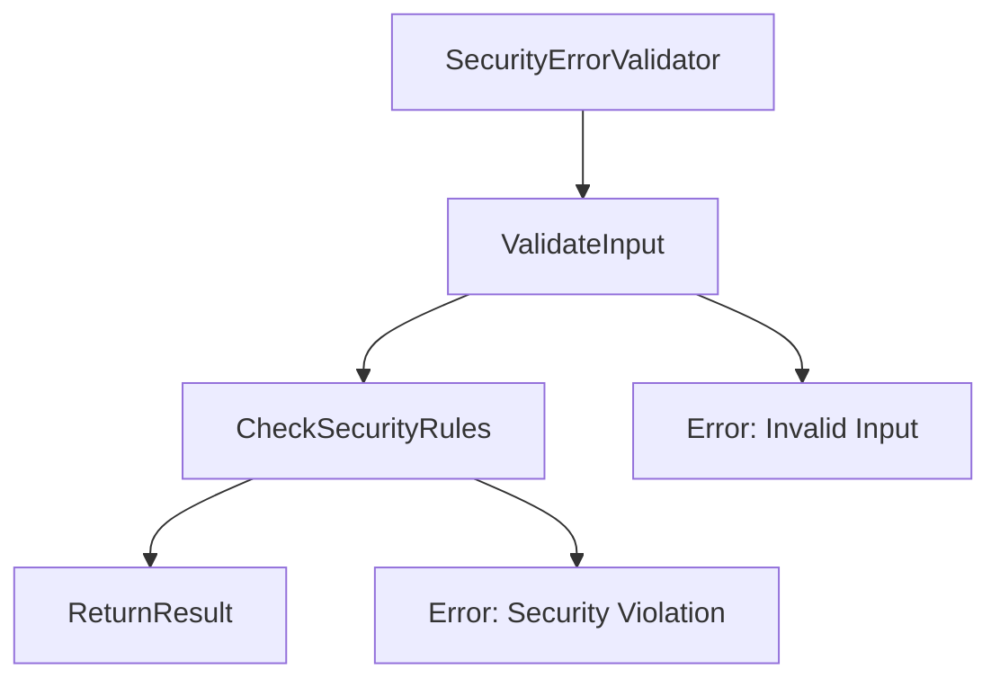

### 2.2 Option Validation
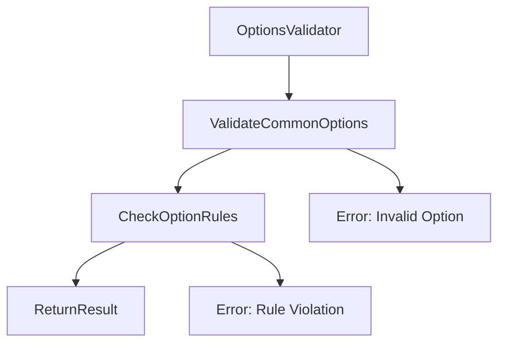

### 2.3 Parameter-Specific Option Validation
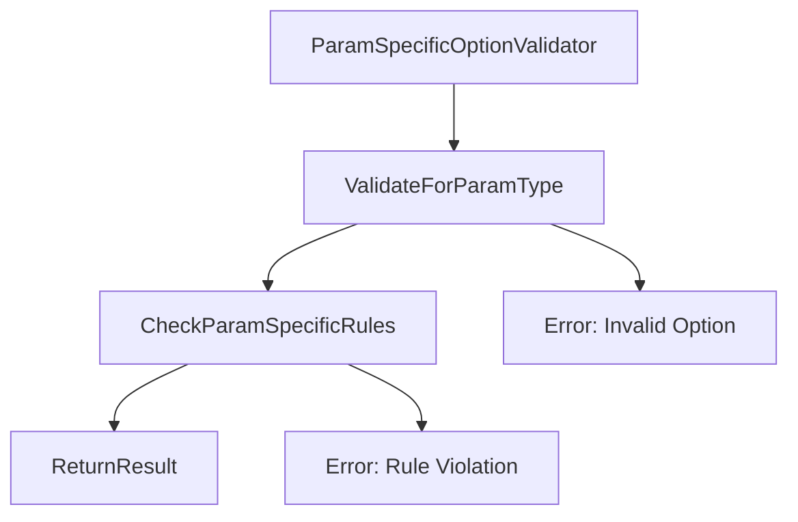

### 2.4 Parameter Validation
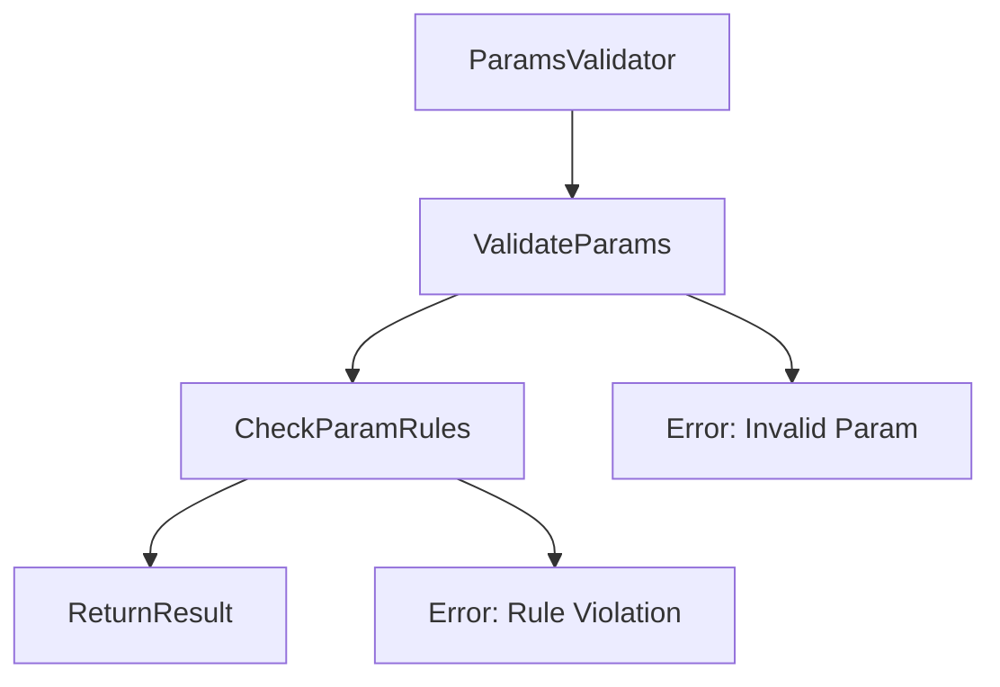

## 3. Validation Rules

### 3.1 Security Rules
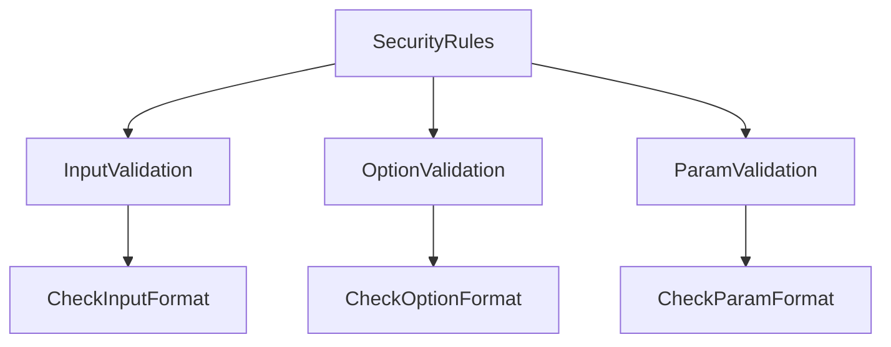

### 3.2 Option Rules
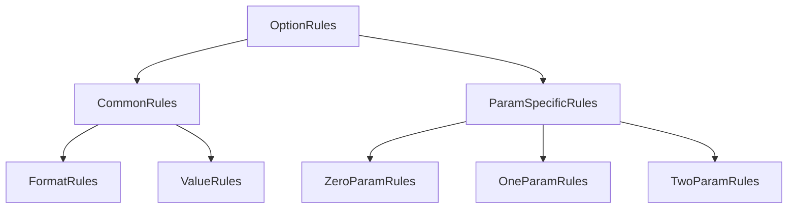

### 3.3 Parameter Rules
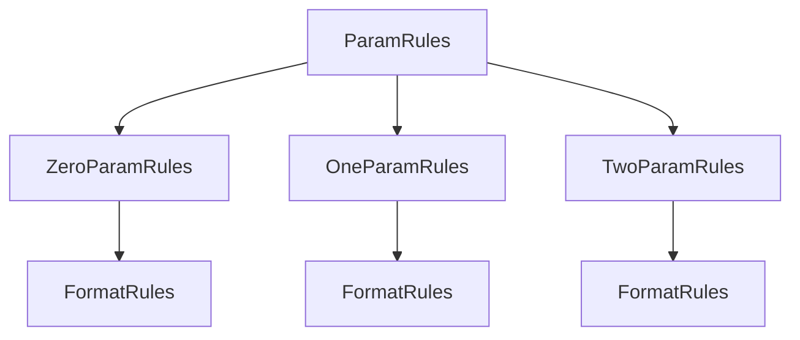

## 4. Error Handling

### 4.1 Error Flow
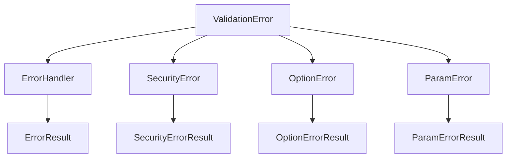

### 4.2 Error Types
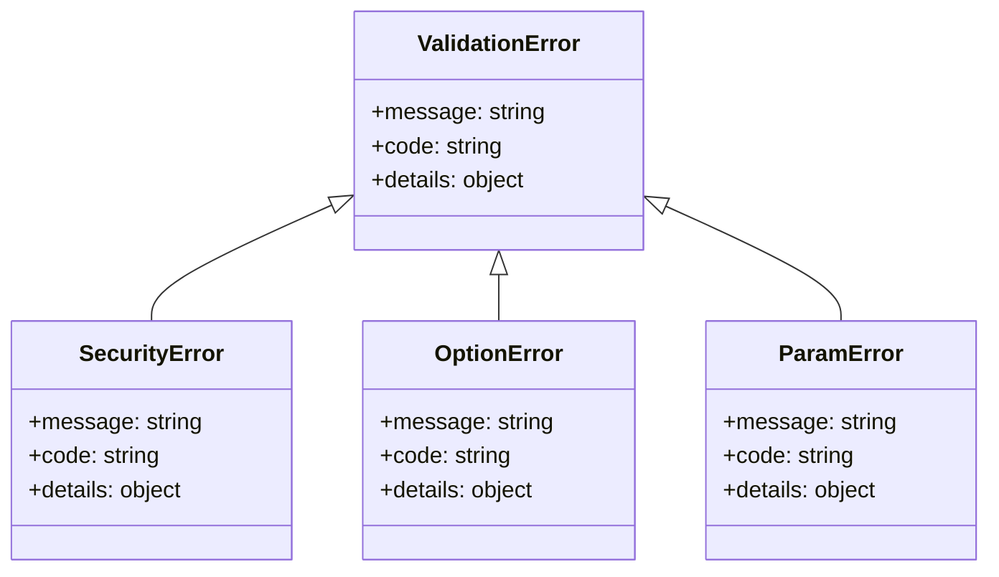

## 5. Validation Results

### 5.1 Result Flow
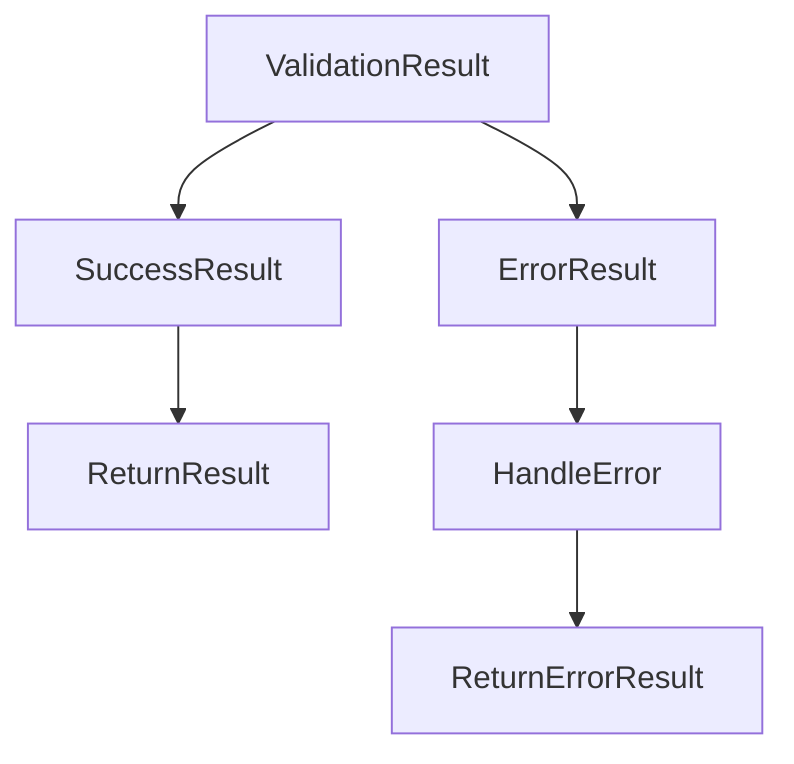

### 5.2 Result Types
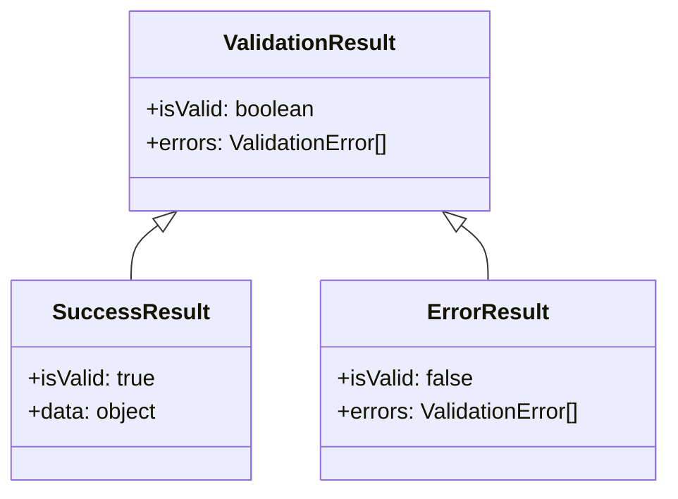

## 6. Option Validation Details

### 6.1 Common Option Validation
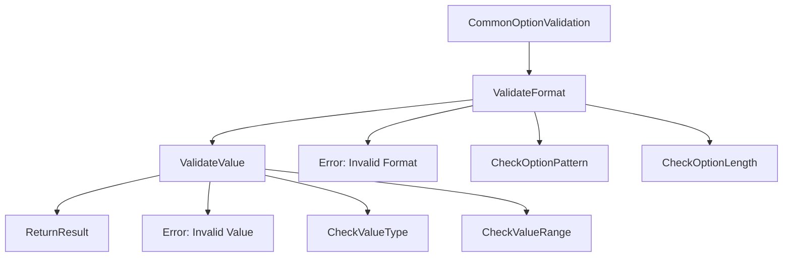

### 6.2 Parameter-Specific Option Validation
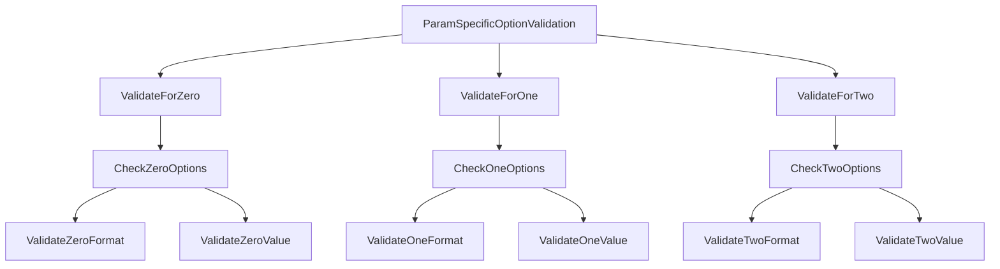

### 6.3 Option Validation Relationships
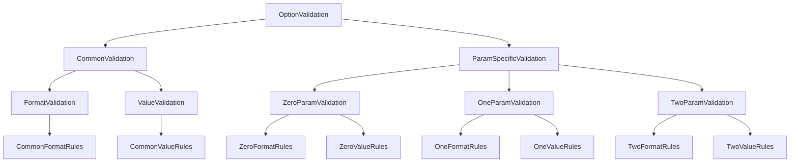