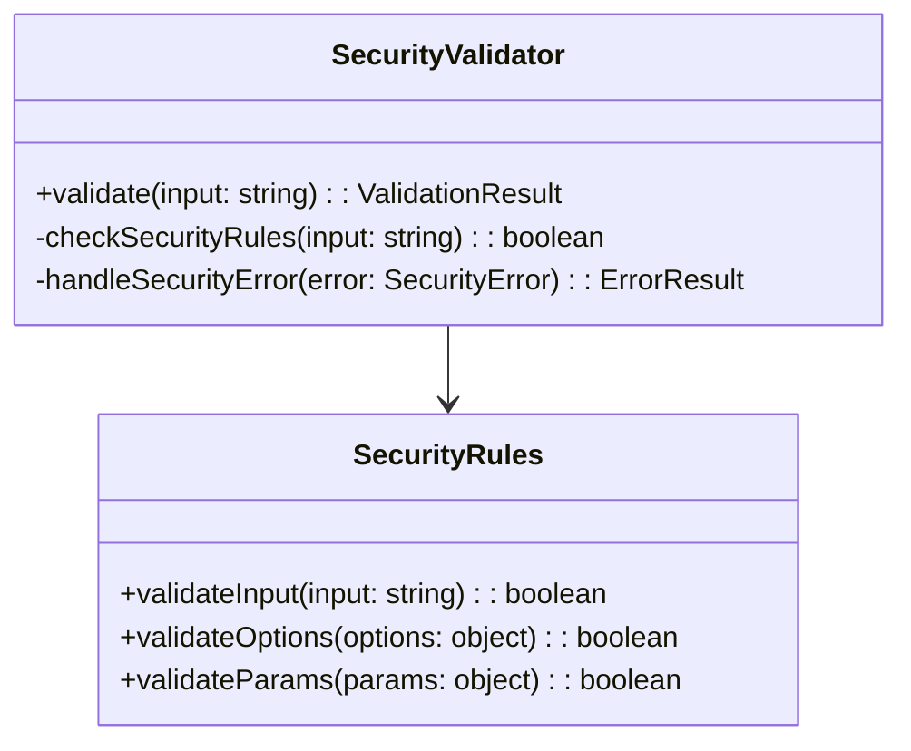
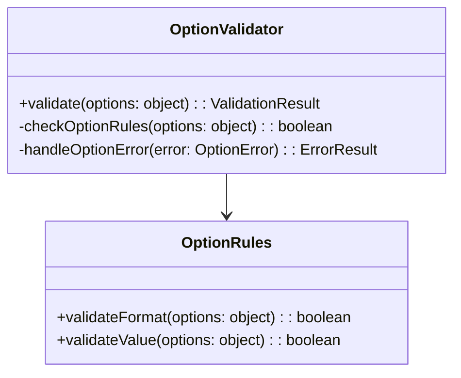
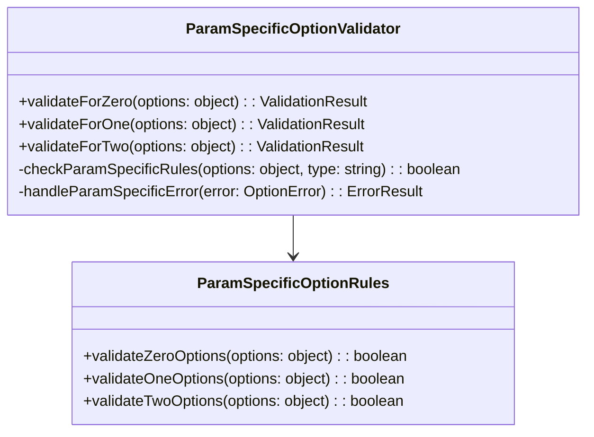
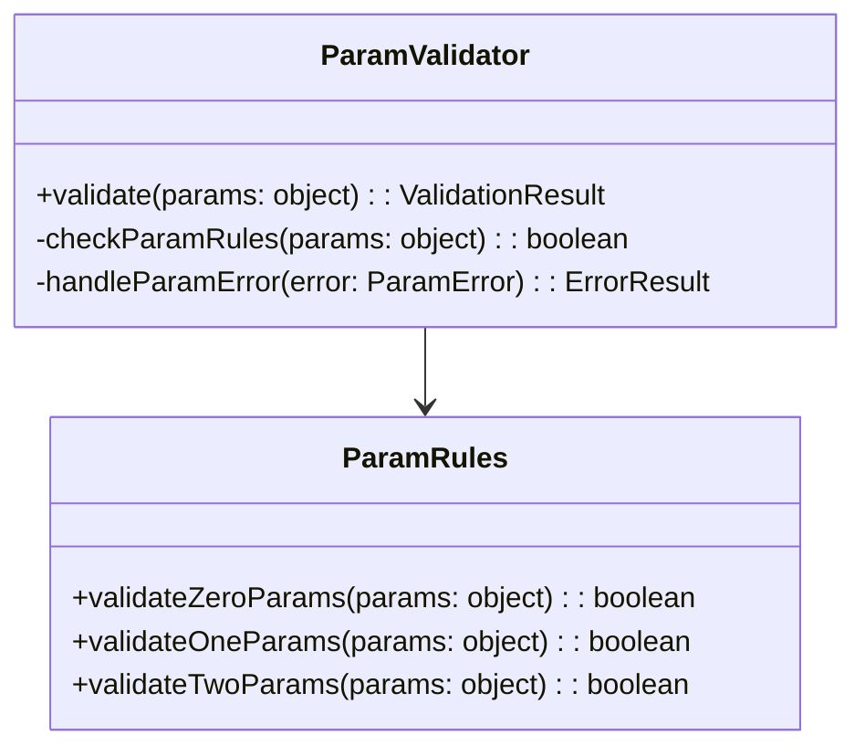
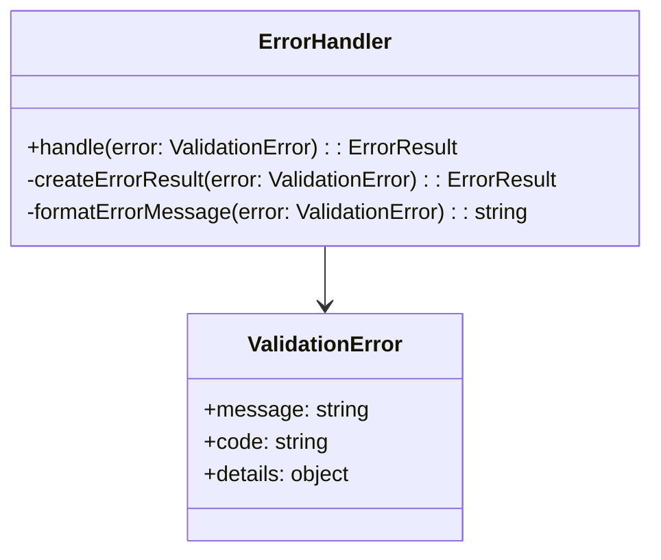
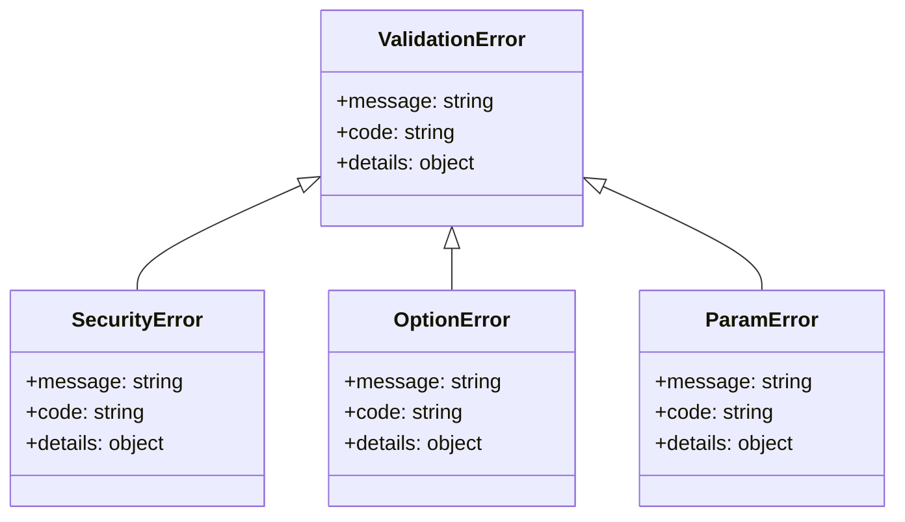
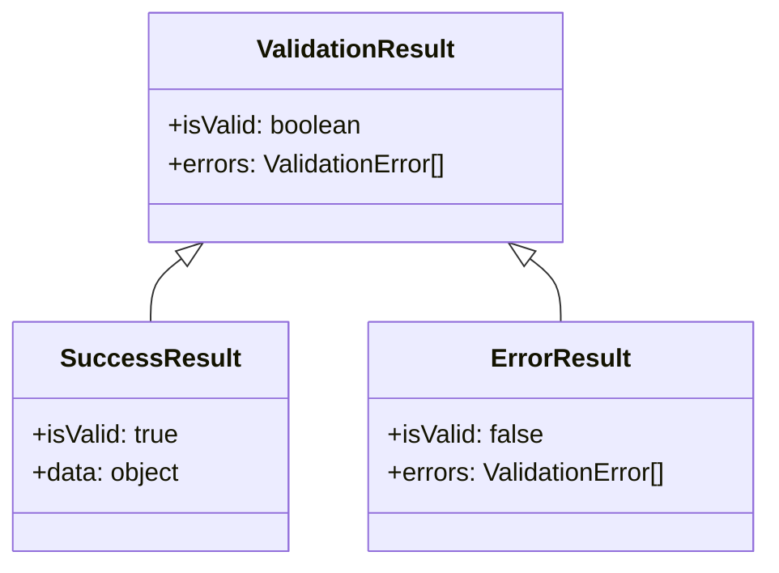
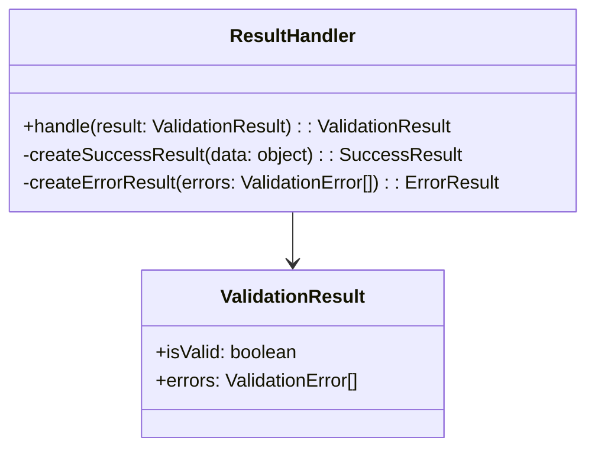
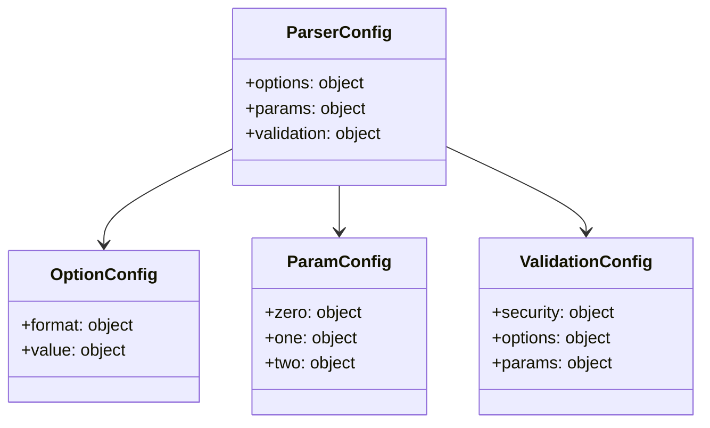
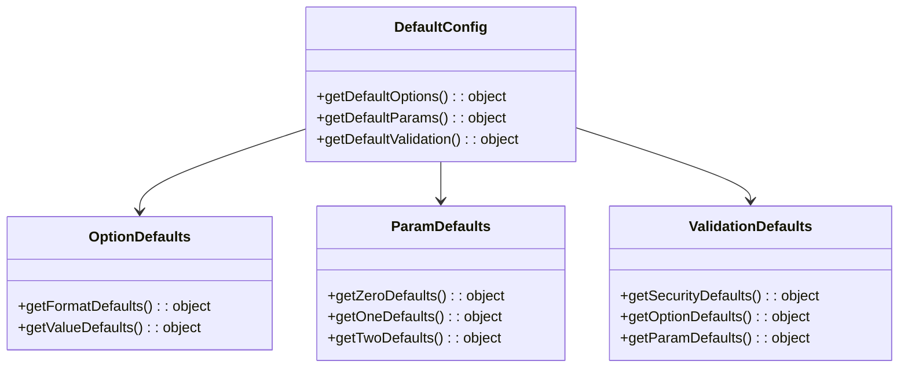

# Implementation Details

This document describes the implementation details of the breakdownparams library.

## 1. Validation Implementation

### 1.1 Security Validation

### 1.2 Option Validation

### 1.3 Parameter-Specific Option Validation

### 1.4 Parameter Validation

## 2. Error Handling Implementation

### 2.1 Error Handler

### 2.2 Error Types

## 3. Validation Results Implementation

### 3.1 Result Types

### 3.2 Result Handler

## 4. Configuration Implementation

### 4.1 Parser Configuration

### 4.2 Default Configuration
